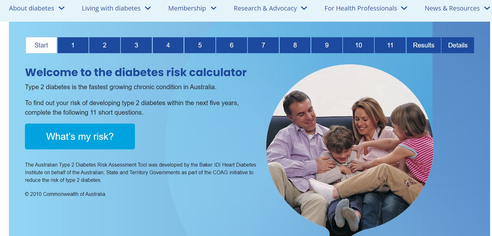

```{r, load_refs, echo=FALSE, cache=FALSE, message=FALSE}
library(RefManageR)
library(icons)
library(readxl)
library(tidyverse)
library(patchwork)

knitr::opts_chunk$set(
  fig.asp = 9/16,
  fig.align = 'center',
  echo = F,
  out.width = "95%",
  dpi= 300)
 
top_icon = function(x) {
  icons::icon_style(
    icons::fontawesome(x),
    position = "fixed", top = 10, right = 10
  )
}
```

class: title-slide
background-image: url("assets/title-image2.jpg")
background-position:  100% 50%
background-size: 100% 100%

# .text-shadow[.black[Predicting diabetes in Australian males at high risk]]
<br><br><br><br><br><br><br><br><br><br>
### .text-shadow[.white[<br><br><br> &nbsp;Dr Kristy Robledo <br> `r icon_style(fontawesome("twitter"), fill="blue")` @kristyrobledo]]
---

.pull-left-1[
  .center[

]
]

--
.pull-right-2[

  .center[

]


.font60[
Courtesy: [World health Organisation](https://www.who.int/news-room/fact-sheets/detail/diabetes) and

Diabetes Australia Risk score calculator developed by Baker IDI Heart Diabetes Institute. [https://www.diabetesaustralia.com.au/risk-calculator/](https://www.diabetesaustralia.com.au/risk-calculator/)
]
]


???

---

# .brand-red[Development cohort: T4DM trial]

.pull-left-1[

.content-box-yellow[

- males aged 50 to 74 years, 
- waist circumference ≥95 cm, 
- impaired glucose tolerance or newly diagnosed type 2 diabetes,
- fasting testosterone ≤14 nmol/L

]
<br>

.content-box-grey[
.blue[**Primary outcome:**] Diabetes at two years, as measured by 2-hour glucose by OGTT $\ge$ 11.1mmol/L
]
]
--

.pull-right-2[
 .center[
  
]

]

.footnote[
Wittert G, Bracken K, Robledo KP, et al. Testosterone treatment to prevent or revert type 2 diabetes in men enrolled in a lifestyle programme (T4DM): A randomised, double-blind, placebo-controlled, 2-year, phase 3b trial. The Lancet Diabetes & Endocrinology 2021;9:32–45. [https://doi.org/10.1016/S2213-8587(20)30367-3](https://doi.org/10.1016/S2213-8587(20)30367-3)
]
---
class: center

```{r, eval=FALSE}
##create wordcloud - this only needs to be run once to create the wordcloud

library(wordcloud2)
library(tidyverse)
library(webshot)
library(htmlwidgets)

df <-as_tibble(
  riskfactors<-c("risk factors", "age", "waist circumference", "weight", "marital status", "current smoker", "shift worker status", "SSRI use", "family history of diabetes", "skeletal muscle mass", "total fat mass", "abdominal fat %" , "total testosterone", "estradiol (E2)", "sex hormone-binding globulin (SHBG)", "2-hour glucose", "Fasting glucose", "glycated haemoglobin (HbA1c)", "insulin", "total cholesterol", "LDL-c", "HDL-c",  "triglycerides", "insulin resistance (HOMA-IR)", "steady state beta cell function (HOMA-B)" , 
               "Lower urinary tract symptoms (LUTS)", 
               "SF-12 physical" ,"SF-12 mental", "MAC-relative to yourself", "MAC- within society generally", "Sense of Coherence", "Pearlin’s Personal Mastery Scale", "CES-Depression Inventory",  "Sufficient exercise"), 
  
) %>%
  add_column(freq = c(2, rep(1,33)))


riskf<-wordcloud2(data=df, size=0.2, color='random-dark',shape = 'rectangle')
saveWidget(riskf, "tmp.html", selfcontained = F)
webshot("tmp.html", "wordcloud.png", delay = 10, vwidth=600, vheight = 400)

```

background-image: url("wordcloud.png")
background-position:  50% 50%
background-size: 90% 90%

# .brand-red[35 risk factors]

---

# .brand-red[Step one: select risk factors + fit model]

.pull-left-1[
.content-box-yellow[
- LASSO penalisation.fn[1] using 469 with complete data
- 10 fold cross validation was used to maximise AUC
- dotted line denotes max AUC, with two non-zero covariates selected in the model (HbA1c and 2-hour glucose)
- refit without penalisation, with AUC **0.809** (n= 665 patients)
- including T treatment.fn[2], AUC **0.816**.
]
]

.pull-right-2[
.center[
  
]
]

.footnote[
1. Zhao S, Daniela Witten, Ali Shojaie "In Defense of the Indefensible: A Very Naïve Approach to High-Dimensional Inference," Statistical Science. 36(4), 562-577, (November 2021) [https://doi.org/10.1214/20-STS815](https://doi.org/10.1214/20-STS815)
1. **T treatment was associated with 40% reduction in diabetes at two years**
]


???
Least absolute shrinkage and selection operator (LASSO) penalisation was performed to select risk factors, prevent over-fitting, and reduce the dimensions of the prediction model [12]. To determine the penalty factor (λ), tenfold cross validation was performed, to maximise the area under the curve (AUC).

---

# .brand-red[Step two: Validation]

.pull-left[
.content-box-yellow[
.font120[
- EXTEND45 cohort of 267,357 participants aged 45 and up
- conduct approved by the University of New South Wales HREC
- baseline questionnaires collected Jan 2006 - Dec 2009
- lab data linked up to July 2013
]
]
]
--

.pull-right[
```{r}
DiagrammeR::grViz("digraph {
  graph [layout = dot, rankdir = TB]
  
  node [shape = rectangle]        
  rec1 [label = 'HbA1c and 2-hour glucose within 6 months (baseline, n=2026)']
  rec2 [label = 'baseline 2-hour glucose <11.1mmol/L & HbA1c<6.5 (n=1189)']
  rec3 [label =  'outcome 2-hour glucose identified 1-4yr post baseline (n=452)']
  rec4 [label = 'restrict to males (n=221)']
  
  # edge definitions with the node IDs
  rec1 -> rec2 -> rec3 -> rec4
  }",
                  height = 500)
```

]

---

# .brand-red[Step three: Model performance (.bold[Discrimination])]

.center[
  
]

???
T4DM AUC 0.820 (95% CI: 0.762-0.877) model has high discriminating ability.
extend45 - 0.806 (95% CI: 0.735-0.877). 

---
# .brand-red[Step three: Model performance (.bold[Calibration])]

.center[
  
]


???
Risk groups: 25%, middle 50%, top 25% of risk
A comparison of the predicted probability versus the observed probability for each risk group is shown in Figure, demonstrating that there is a higher probability observed than predicted in the model validation cohort.

Calibration - T4DM
The Brier score was low at 0.07, the Hosmer–Lemeshow χ^2 statistic was 3.92, (p=0.86), and the p-value for the Osius-Rojek and Stukel tests were 0.71 and 0.04 respectively, indicating good calibration within the model development cohort, other than the Stukel test.

Extend45
The calibration according to the Hosmer-Lemeshow goodness of fit test was poor (χ^2=106, p<0.001). However the Brier score for assessing prediction accuracy was low at 0.13 and the p-value for the Stukel test was 0.62, indicating a good fit, while the p-value for the Osius-Rojek test was p<0.001. 

---
# .brand-red[Step four: Model performance (.bold[Recalibration])]

.center[
<br>
  
]

???
Given this under-prediction, recalibration in the large was performed and the intercept was estimated as 0.67. Once this was taken into account, the predicted probabilities from the model showed better alignment with the observed probabilities 
---
class: sydney-blue

# **Take home messages**

.font130[
- Risk score has been developed for Australian high risk men
]
--
.font130[
- 2-hour glucose by OGTT and Hb1ac are important risk factors
]
--
.font130[
- calibration in an opportunistic validation cohort gave some underestimation of risk (probably due to lifestyle component of T4DM)
]
--
.font130[
- high risk men not developing diabetes is likely due to changes in body composition over the trial
]
--
.font130[
- Future work: Shiny app for calculation of risk groups and **Publication**
]

???
OGTT is not a fun test

---
class: sydney-red
background-image: url(assets/USydLogo-white.svg),url(https://upload.wikimedia.org/wikipedia/commons/b/be/Sharingan_triple.svg)
background-size: 260px,100px
background-position: 5% 95%,4% 70%

# Thanks!

.pull-right-2[
.pull-up[
- Centre for Health Record Linkage (CHeReL), [http://www.cherel.org.au/](http://www.cherel.org.au/) for data linkage
- Secure Unified Research Environment (SURE) for provision of secure data access
- Participants of the T4DM trial and EXTEND45 cohort study
- co-authors, particularly Prof Gary Wittert and Prof Ian Marschner 
]

.pull-down[

<a href="mailto:kristy.robledo@sydney.edu.au">
.white[`r icons::fontawesome("paper-plane")` kristy.robledo@sydney.edu.au]
</a>

<a href="https://kristyrobledo.github.io/GCIG-EC/">
.white[`r icons::fontawesome("link")` kristyrobledo.github.io/GCIG-EC/]
</a>

<a href="http://twitter.com/kristyrobledo">
.white[`r icons::fontawesome("twitter")` @kristyrobledo]
</a>

<a href="http://github.com/kristyrobledo">
.white[`r icons::fontawesome("github")` @kristyrobledo]
</a>

]]

???
sharingan
---
class: sydney-yellow

# Extras:  checks and more checks 

1. check relationships of continuous data and outcome

--

2. Account for missing data by assuming missing outcome is no diabetes

--

3. Check for inclusion of any non-zero covariates :

  - Best addition of age gave AUC .bold[0.830] (minor increase from 0.816)

--

3. Check for interactions

--

.center[
.content-box-grey[

BINGO: HbA1c and treatment

]
]

???
Given that 469 participants had all risk factors and outcome data available, a sensitivity analysis was performed assuming all patients with missing outcome data were not diabetic at two years. This gave a total of 539 patients available to perform logistic regression with LASSO (extra 70 patients) to identify the optimal λ and therefore the optimum risk factors in the model (step one). The previous model of HbA1c and 2-hour glucose by OGTT was within one standard error of the optimal λ, which is considered the most parsimonious model with the consideration of many risk factors (reference). 

